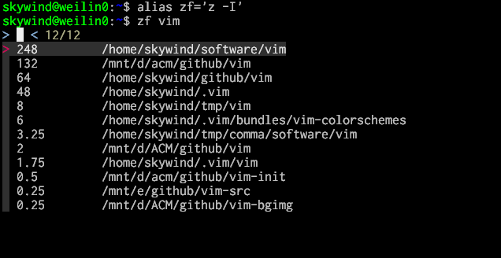
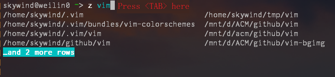
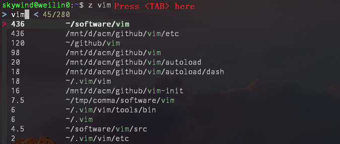
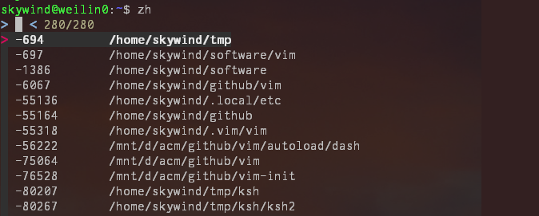

# z.lua

快速路径切换工具（类似 z.sh / autojump / fasd），兼容 Windows 和所有 Posix Shell 以及 Fish Shell，同时包含了众多改进。


## Description

z.lua 是一个快速路径切换工具，它会跟踪你在 shell 下访问过的路径，通过一套称为 Frecent 的机制（源自 FireFox），经过一段简短的学习之后，z.lua 会帮你跳转到所有匹配正则关键字的路径里 Frecent 值最高的那条路径去。

正则将按顺序进行匹配，"z foo bar" 可以匹配到 /foo/bar ，但是不能匹配 /bar/foo。


## Features

- 性能比 **z.sh** 快三倍，比 **fasd** / **autojump** 快十倍以上。
- 支持 Posix Shell：bash, zsh, dash, sh, ash, busybox 等等。
- 支持 Fish Shell，Power Shell 和 Windows cmd。
- 使用增强匹配算法，更准确的带你去到你想去的地方。
- 低占用，能够仅在当前路径改变时才更新数据库（将 `$_ZL_ADD_ONCE` 设成 1）。
- 交互选择模式，如果有多个匹配结果的话，跳转前允许你进行选择。
- 集成 fzf （可选），可以用来做可视化选择或者参数补全。
- 快速跳转到父目录，或者项目根目录，代替反复 “cd ../../.." 。
- 兼容 lua 5.1, 5.2 和 5.3 以上版本。
- 自包含且无额外依赖，单个 `z.lua` 文件完成所有工作。


## Examples

```bash
z foo       # 跳转到包含 foo 并且权重（Frecent）最高的路径
z foo bar   # 跳转到同时包含 foo 和 bar 并且权重最高的路径
z -r foo    # 跳转到包含 foo 并且访问次数最高的路径
z -t foo    # 跳转到包含 foo 并且最近访问过的路径
z -l foo    # 不跳转，只是列出所有匹配 foo 的路径
z -c foo    # 跳转到包含 foo 并且是当前路径的子路径的权重最高的路径
z -e foo    # 不跳转，只是打印出匹配 foo 并且权重最高的路径
z -i foo    # 进入交互式选择模式，让你自己挑选去哪里（多个结果的话）
z -I foo    # 进入交互式选择模式，但是使用 fzf 来选择
z -b foo    # 跳转到父目录中名称以 foo 开头的那一级
```


## Install

- Posix Shells（Bash、zsh、dash、sh 或 BusyBox 等）：

  在你的 `.bashrc`, `.zshrc` 或者 `.profile` 文件中按 shell 类型添加对应语句：

      eval "$(lua /path/to/z.lua  --init bash)"   # BASH 初始化
      eval "$(lua /path/to/z.lua  --init zsh)"    # ZSH 初始化
      eval "$(lua /path/to/z.lua  --init posix)"  # Posix shell 初始化

  用下面参数初始化会进入“增强匹配模式”：

      eval "$(lua /path/to/z.lua  --init bash once enhanced)"   # BASH 初始化
      eval "$(lua /path/to/z.lua  --init zsh once enhanced)"    # ZSH 初始化
      eval "$(lua /path/to/z.lua  --init posix once enhanced)"  # Posix shell 初始化

  同时 zsh 支持 antigen/oh-my-zsh 等包管理器，可以用下面路径：

      skywind3000/z.lua

  进行安装，比如 antigen 的话，在 `.zshrc` 中加入：

      antigen bundle skywind3000/z.lua

  就可以了（主要要放在 antigen apply 语句之前）。
  
  **注意**：使用 WSL-1 的用户，需要安装 `lua-filesystem` 包：

      sudo apt-get install lua-filesystem

  这是由于 wsl-1 的 [bug](https://github.com/microsoft/WSL/issues/5505) 引起的，使用 lua-filesystem 可以避免该问题。

- Fish Shell:

  新建 `~/.config/fish/conf.d/z.fish` 文件，并包含如下代码：

      source (lua /path/to/z.lua --init fish | psub)

  Fish version `2.4.0` 或者以上版本都支持，还有一种初始化方法：

      lua /path/to/z.lua --init fish > ~/.config/fish/conf.d/z.fish

  但是第二种方法需要记得在 z.lua 位置改变或者 lua 版本升级后需要重新生成。

- Power Shell:

  在你 Power Shell 的配置文件 `profile.ps1` 中放入下面语句：

      Invoke-Expression (& { (lua /path/to/z.lua --init powershell) -join "`n" })


- Windows cmd (with clink):

  - 将 z.lua 和 z.cmd 拷贝到 clink 的安装目录。
  - 将 clink 的安装目录添加到 `%PATH%` (z.cmd 可以被任意位置调用到)。
  - 保证 lua 命令在你的 `%PATH%` 环境变量中。
  

- Windows cmder:

  - 将 z.lua 和 z.cmd 拷贝到 cmder/vendor 目录中。
  - 将 cmder/vendor 添加到环境变量 `%PATH%` 里面。
  - 保证 lua 命令在你的 `%PATH%` 环境变量中。


## Options

- 设置 `$_ZL_CMD` 来改变命令名称 (默认为 z)。
- 设置 `$_ZL_DATA` 来改变数据文件 (default ~/.zlua)。
- 设置 `$_ZL_NO_PROMPT_COMMAND` 为 1 来跳过钩子函数初始化（方便自己处理）。
- 设置 `$_ZL_EXCLUDE_DIRS` 逗号分隔的路径列表，列表内的路径不会被收集。
- 设置 `$_ZL_ADD_ONCE` 为 '1' 时，仅在当前路径 `$PWD` 改变时才更新数据库。
- 设置 `$_ZL_MAXAGE` 来确定一个数据老化的阀值 (默认为 5000)。
- 设置 `$_ZL_CD` 用来指定你想用的 cd 命令，比如有人用 cd_func 。
- 设置 `$_ZL_ECHO` 为 1 可以在跳转后显示目标路径名称。
- 设置 `$_ZL_MATCH_MODE` 为 1 可以打开 “增强匹配模式”。
- 设置 `$_ZL_HYPHEN` 为 1 可以允许关键字中包含横线 （横线默认是 lua 正则关键字，要转写成 `%-`）。

## Aging

`z.lua` 在数据库中为每条路径维护着一个称为 rank 的字段，用于记录每条历史路径的访问次数，每次访问某路径，该路径对应 rank 字段的值就会增加 1。随着被添加的路径越来越多，`z.lua` 使用一种称为 “数据老化” 的方式来控制数据的总量。即，每次更新数据库后，会将所有路径的 rank 值加起来，如果这个值大于 5000 （`$_ZL_MAXAGE`），所有路径的 rank 值都会乘以 0.9，然后剔除所有 rank 小于 1 的记录。


## Frecency

Frecency 是一个由 'recent' 和 'frequency' 组成的合成词，这个术语由 Mozilla 发明，用于同时兼顾访问的频率和上一次访问到现在的时间差（是否最近访问）两种情况。

对于 z.lua，一条路径如果访问次数过低，它的 rank 值就会比较低，但是如果它最近被访问过，那么它将迅速获得一个比其他曾经频繁访问但是最近没有访问过的路径更高的权重。Frecent 并不记录在数据库中，是运行的时候即时计算出来的。


## 默认匹配算法

默认情况下 z.lua 使用和 z.sh 类似的匹配算法，成为默认匹配法。给定路径会按顺序匹配各个正则表达式。

- cd 到一个包含 foo 的路径:

      z foo

- cd 到一个以 foo 结尾的路径:

      z foo$

- 使用多个参数进行跳转:

  假设路径历史数据库（~/.zlua）中有两条记录：

      10   /home/user/work/inbox
      30   /home/user/mail/inbox

  `"z in"`将会跳转到 `/home/user/mail/inbox` 因为它有更高的权重，同时你可以传递更多参数给 z.lua 来更加精确的指明，如 `"z w in"` 则会让你跳到 `/home/user/work/inbox`。

## 增强匹配算法

你可以通过设置环境变量来启用增强匹配模式:

    export _ZL_MATCH_MODE=1

或者使用下面语句：

    eval "$(lua /path/to/z.lua --init bash enhanced)"

进行初始化，他们是等效的，记得把上面的 bash 可以根据你的 shell 改为 `zsh` 或者 `posix`。


对于一个给定的正则关键字序列（即 z 命令后面的参数），只有同时满足两个条件才算匹配成功：

1. 正则关键字将按顺序进行匹配（这条和默认匹配法相同）。
2. 最后一个关键字可以和路径名的最后一段相匹配。

如果两条规则同时启用找不到任何结果，那么将会退回到只用规则 1 进行筛选，这两条规则是参考 fasd 引入的。

- 匹配路径名的最后一段：

  假设数据库内容为：

      10   /home/user/workspace
      20   /home/user/workspace/project1
      30   /home/user/workspace/project2
      40   /home/user/workspace/project3

  在增强模式下使用 `"z wo"` 的话，只有 `/home/user/workspace` 满足匹配，因为按照第二条规则，这是唯一一条最有一段名称匹配 `wo` 的路径。

  因为最后一级目录名称总是最容易记住的，所以给到它比较高的优先级。在默认匹配算法中，你同样可以用 `"z space$"` 来达到相同的目的，但是 `"z wo"` 可以打更少的字。

  小技巧: 

  - 如果你在增强匹配算法下，想让最后一个关键字不当匹配最后一段路径名，还可以像默认匹配算法中一样匹配路径的其他部分的话，你可以在最后加一个独立的 '$' 参数，比如：`"z wo $"`
  - 如果你在增强匹配算法下，想让最后一个关键字匹配最后一段路径名以前的部分，那么可以增加一个斜杆参数，比如：`"z wo /"`。
  

- 如果没法匹配，同时又存在一条路径名和关键字相同，那么 cd 过去:

  有时候如果你输入：

      z foo

  但是数据库里又没有任何匹配 foo 的记录，然后却存在一个可以在当前位置访问的目录，刚好名字是 "foo"，那么 "`z foo`" 的效果将会和下面的命令效果相同：

      cd foo

  因此，在增强匹配算法中，你总可以象 cd 命令一样使用 z 命令，而不必当心目标路径是否被记录过。

- 忽略当前路径：

  如果你使用 `z xxx` 但是当前路径恰好是最佳匹配结果，那么 z.lua 会使用次优结果进行跳转。假设有如下数据：

      10   /Users/Great_Wall/.rbenv/versions/2.4.1/lib/ruby/gems
      20   /Library/Ruby/Gems/2.0.0/gems

  默认情况下，当我使用 `z gems` 时，我会被带到 `/Library/Ruby/Gems/2.0.0/gems`，因为它有更高权重，但是可能并不是我想要去的地方，这时我按一下方向键上键，再次执行 `z gems`，那么我就能被带到 `/Users/Great_Wall/.rbenv/versions/2.4.1/lib/ruby/gems` 目录中，而这正是我想去的地方。

  我当然可以每次使用`z env gems` 来精确指明，但是每当我输入 `z xxx` 我必然是想进行路径跳转的，而不是呆在原地，所以使用增强匹配模式，即便当前目录是最佳匹配，它也能懂得你想跳转的心思。

再我最初实现 z.lua 时，只有一个和 z.sh 类似的默认匹配算法，在网友的建议下，我陆续学习了来自 fasd / autojump 中的优秀理念，并加以完善改进，成为如今集三家之长的 “增强匹配算法” ，给它取个昵称，叫做 “更懂你的匹配算法”。


## Add once

何时更新数据呢？默认情况下，z.lua 会在每次显示命令提示符时记录当前路径（和 z.sh 一致），但是还提供了一个 $_ZL_ADD_ONCE 的环境变量选项，设置成 1 的话，只有当前路径改变，才会将新路径添加到数据库。

除了设置环境变量外，不同的 shell 下还可以在初始化时增加 "once" 参数来达到相同目的，比如：

````bash
eval "$(lua /path/to/z.lua --init bash once enhanced)"
eval "$(lua /path/to/z.lua --init zsh once enhanced)"
source (lua /path/to/z.lua --init fish once enhanced | psub)
````

将会同时启用增强匹配算法和 once 机制，在一些比较慢的硬件下（路由器，cygwin，msys），使用该机制将有效的提升性能。其实 autojump 在 zsh 下会使用类似 once 的机制，而 bash 下则和 z.sh 类似。

从效果上来讲，z.sh 的模式（关闭 once）强调的是 “在某路径下工作的时间长短”，而 autojump 的模式（启用 once）则强调 “进入某路径的次数多少”。

## 交互式选择模式

使用 -i 参数进行跳转时, 如果有多个匹配结果，那么 z.lua 会给你显示一个列表：

```bash
$ z -i soft
3:  0.25        /home/data/software
2:  3.75        /home/skywind/tmp/comma/software
1:  21          /home/skywind/software
> {光标位置}
```

然后你按照最前面的序号输入你想要去的地方，比如输入 3 就会进入 `/home/data/software`。如果你不输入任何东西直接按回车，那么将会直接退出而不进行任何跳转。

PS：如果你使用 Fish shell，需要 2.7.0 以上才支持该功能。

## FZF supports

版本 1.1.0 引入了新的 `"-I"` 参数，让你可以使用 fzf 在多项结果进行快速选择：




当你使用 `"z -I vim"` 时，12 条路径被筛选出来，并按照 frecent 排序，他们都包含 "vim" 关键字，在实际 cd 改变路径前，z.lua 会调用 fzf 来让你更方便的选择你想去的地方，每条记录包含左边的 frecent 权重和右边的路径名，权重越高的排在越前面。

你可以在 fzf 里输入一些**空格分隔**的关键字（不需要先后顺序），或者按 `CTRL+J` / `CTRL+K` （方向键的上下也可以）进行选择，`ESC` 或者 `CTRL`+`D`/`G` 放弃。

你仍然可以用老方法，通过在 `z` 命令后面添加更多关键词来精确的匹配你想去的地方，这个特性给了你一个可视化的方式来做这件事情。为了方便起见，通常把 `z -I` alias 成 `zf` (z + fuzzy finder)。如果搜索结果只有一项，那么 z.lua 会直接跳转过去，不需要启动 fzf 再选择一遍，只有多项结果要选择时，才会启动 fzf。

`"z -I ."` 或者 `"zf ."` 可以让 fzf 来对整个数据库中的路径进行选择。

PS：你可以使用 `$_ZL_FZF` 环境变量来精确指明 fzf 的可执行路径，默认的话就是 fzf。如果你使用 Fish shell，需要 2.7.0 以上才支持该功能。


## 快速回到父目录

`"-b"` 选项可以快速回到某一级父目录，避免重复的输入 "cd ../../.."。

- **(没有参数)**：`cd` 到项目根目录，即跳转到最近的包含 (.git/.svn/.hg) 的父目录。
- **(单个参数)**：`cd` 到离当前目录最近的以关键字开头的父目录，如果找不到就尝试跳到包含关键字的父目录。
- **(两个参数)**：将当前路径中的第一个关键词替换为第二个关键词。

先将 `z -b` 别名成 `zb`：

```bash
# 一直向上退到项目根目录（就是里面有一个 .git 目录的地方）
~/github/lorem/src/public$ zb
  => cd ~/github/lorem

# cd 到第一个以 g 开头的父目录
~/github/vimium/src/public$ zb g
  => cd ~/github

# 快速回到 site 目录
~/github/demo/src/org/main/site/utils/file/reader/whatever$ zb si
  => cd ~/github/demo/src/org/main/site

# 将 jekyll 替换为 ghost
~/github/jekyll/test$ zb jekyll ghost
  => cd ~/github/ghost/test
```

向后跳转同样也支持环境变量 `$_ZL_ECHO`（用来显示跳转结果），这样可以搭配其他工具，在目标目录内执行命令，而并不需要改变当前工作目录（比如：``ls `zb git` ``）。

环境变量 `$_ZL_ROOT_MARKERS` 是一个逗号分隔的列表，用来识别项目根目录，可以重定义成：


```bash
export _ZL_ROOT_MARKERS=".git,.svn,.hg,.root,package.json"
```

这样在用 `zb` 时，可以回到包含 `.root`文件，或者 `package.json` 文件的父目录。

**Bonus**：`zb ..` 相当于 `cd ..`，`zb ...` 相当于 `cd ../..`，而 `zb ....` 相当于 `cd ../../..` 等等。 最后 `zb ..20` 等同于调用 `cd ..` 二十次。

**Bonus**: 试试 `z -b -i` 以及 `z -b -I`，推荐把他们取个别名成 `zbi` 和 `zbf`。


## 补全功能

zsh/fish 的补全系统是比较完善的，使用 `z foo<tab>` 就能触发补全，显示一个列表：



再次按 `<tab>` 键，就可以用可视化的方式对列表进行选择。

在 bash 下面补全系统没有那么强大，所以 z.lua 引入了 fzf 补全，初始化时在 `--init` 后追加 `fzf` 关键字：

```bash
eval "$(lua /path/to/z.lua --init bash enhanced once echo fzf)"
```

然后你在 bash 中，输入部分关键字后按 tab，就能把匹配的路径列出来：



有了 fzf 的帮助，bash 下补全也非常方便了。注意看左边的权重，fzf 搜索过滤的顺序是有讲究的，Frecent 权重越高的越靠前，不是乱排序的，更不是简单的按字符串字母排序。这里完全保证权重越高的路径越靠前。

`z.lua` 可以同 [fz](https://github.com/changyuheng/fz) 协作以提供**更好的补全结果**，详细见 [FAQ](https://github.com/skywind3000/z.lua/wiki/FAQ#fzsh-for-better-completion)。

注意：该功能在初始化 z.lua 之前，会检测 $PATH 中是否有 fzf 这个程序，有的话才启用。


## MRU

`z.lua` 提供 `dirstack` 让你更便捷的访问最近刚刚去过的目录，而不需要输入任何关键字。这个方法叫做 `dirstack`，它记录着最近你刚刚去过的 10 条最新路径，然后是用 `z -`，`z --` 和 `z -{num}` 来操作：

```bash
# 显示当前的 dir stack
$ z --    
 0  /home/skywind/work/match/memory-match
 1  /home/skywind/.local/etc
 2  /home/skywind/software/vifm-0.9.1
 3  /home/skywind/work
 4  /home/skywind/work/match

# cd 到栈里 2 号路径
$ z -2
  => cd /home/skywind/software/vifm-0.9.1

# 弹出栈顶 (cd 到上一次的老路径)，和 "z -0" 相同
$ z -
  => cd -
```

这个 `dirstack` 是根据 z.lua 的路径历史数据库计算的出来的，和具体的 shell 或者操作系统无关。你退出再登陆不会丢失这些记录，不同的 shell 之间也可以共享同一份记录。

此外，还能通过前面提到的 `-I` 和 `-t` 参数组和，使用 fzf 选择最近去过的目录：

```bash
alias zh='z -I -t .'
```

方便起见，定义个新的别名 `zh`（回到历史路径的意思），我们用 `-t` 参数来告诉 `z.lua` 按时间戳为权重排序，同时 `-I` 启用 fzf 搜索，最后句号代表任意路径。

那么当我们在命令行敲入 zh 时，就可以用 fzf 进行历史路径操作了：



第一列上次访问距今多少秒，第二列是目录名。你可以试着敲几个字母，用 fzf 的字符串模糊匹配进行定位，或者用光标键的上和下（CTRL+J/K 也可以）来上下移动，最后按回车 cd 过去，或者 ESC 放弃。


## Tips

推荐一些常用的命令别名:

```bash
alias zc='z -c'      # 严格匹配当前路径的子路径
alias zz='z -i'      # 使用交互式选择模式
alias zf='z -I'      # 使用 fzf 对多个结果进行选择
alias zb='z -b'      # 快速回到父目录
```

导入 z.sh 的数据：


```bash
cat ~/.z >> ~/.zlua
```

导入 autojump 的数据：

```bash
FN="$HOME/.local/share/autojump/autojump.txt"
awk -F '\t' '{print $2 "|" $1 "|" 0}' $FN >> ~/.zlua
```

要更好的使用 `z.lua`，别忘记阅读：[Frequently Asked Questions](https://github.com/skywind3000/z.lua/wiki/FAQ)。


## Benchmark

最慢的部分当然是添加当前路径到数据库。该操作会在每次你按回车时执行，所以我在我的 Nas 上做了个对比：

```bash
$ time autojump --add /tmp
real    0m0.352s
user    0m0.077s
sys     0m0.185s

$ time fasd -A /tmp
real    0m0.618s
user    0m0.076s
sys     0m0.242s

$ time _z --add /tmp
real    0m0.194s
user    0m0.046s
sys     0m0.154s

$ time _zlua --add /tmp
real    0m0.052s
user    0m0.015s
sys     0m0.030s
```

可以看出，z.lua 是消耗资源最少，并且最快的，可以更流畅的在性能不好的环境中使用。

## Why Lua ?

更好的兼容性，最开始我想要在我的路由器和 Nas 系统上使用 z.sh，但是它依赖的 awk 版本比较高，这两个系统上的 awk 都是一个 busybox 的经过裁剪的 awk ，z.sh 完全无法正常工作。使用 shell 开发还有一个问题是严重依赖 shell 的版本，很多逻辑既要在 zsh 下可以运行，又要在 dash 下能跑，用 lua 开发的话，核心逻辑全部写成 lua 不用考虑太多琐碎的兼容性，可以为各种 shell 提供完全一致的体验。

描述力强，可以更好的实现核心功能，同时速度更快，纯 shell 开发的话，太多语句是通过子进程 shell 的模式运行，所以性能很差，而 Python 开发的话启动速度又太慢，我在 Cygwin/msys 下用 z.sh 都觉得很卡，autojump/fasd 卡到不能用。

最关键的一点，Lua 速度很快 200 KB 的可执行程序，启动速度是 python 的 3倍，perl 的 2 倍，很多命令行工具 go/rust 写成，动不动就 2MB / 3MB，他们都还没有完成加载，lua 脚本可能都运行完了。


## Credit

Releated projects:

- [rupa/z](https://github.com/rupa/z): origin z.sh implementation
- [JannesMeyer/z.ps](https://github.com/JannesMeyer/z.ps): z for powershell


## License

Licensed under MIT license.

