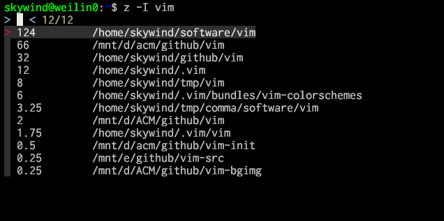

# z.lua

A command line tool which helps you navigate faster by learning your habits :zap:

An alternative to [z.sh](https://github.com/rupa/z) with windows and posix shells support and various improvements.

【[README in Chinese | 中文文档](README.cn.md)】


## Description

z.lua is a faster way to navigate your filesystem. It tracks your most used directories, based on 'frecency'.  After  a  short  learning  phase, z will take you to the most 'frecent' directory that matches ALL of the regexes given on the command line, in order.

For example, `z foo bar` would match `/foo/bar` but not `/bar/foo`.


## Features

- **10x** times faster than **fasd** and **autojump**, **3x** times faster than **z.sh**.
- Available for **posix shells**: bash, zsh, dash, sh, ash, busybox and etc.
- Available for Fish Shell, Power Shell and Windows cmd.
- Enhanced matching mode takes you to where ever you want precisely.
- Allow updating database only if `$PWD` changed with "$_ZL_ADD_ONCE" set to 1.
- Interactive selection enables you to choose where to go before cd.
- Interactive selection with FZF (optional).
- Quickly go back to a parent directory instead of typing "cd ../../..".
- Corresponding experience in different shells and operating systems. 
- Compatible with Lua 5.1, 5.2 and 5.3+
- Self contained, distributed as a single `z.lua` script, no other dependence.


## Examples

```bash
z foo       # cd to most frecent dir matching foo
z foo bar   # cd to most frecent dir matching foo and bar
z -r foo    # cd to highest ranked dir matching foo
z -t foo    # cd to most recently accessed dir matching foo
z -l foo    # list matches instead of cd
z -c foo    # restrict matches to subdirs of $PWD
z -e foo    # echo the best match, don't cd
z -i foo    # cd with interactive selection
z -I foo    # cd with interactive selection using fzf
z -b foo    # cd to the parent directory starting with foo
```


## Install

- Bash:

  put something like this in your `.bashrc`:

      eval "$(lua /path/to/z.lua --init bash)"

  the default matching algorithm is similar to z.sh to keep compatible, you may like the enhanced matching algorithm for productivity:

      eval "$(lua /path/to/z.lua --init bash enhanced once)"

  and perhaps this:

      export _ZL_ECHO=1

  if you want `z.lua` print the new directory after cd. 

  If you want `fzf` tab completion use:

      eval "$(lua /path/to/z.lua --init bash enhanced once fzf)"

- Zsh:

  put something like this in your `.zshrc`:

      eval "$(lua /path/to/z.lua --init zsh)"

  Options like "enhanced" and "echo" can be used after `--init` too. It can also be initialized from "skywind3000/z.lua" with your zsh plugin managers (antigen / oh-my-zsh).

- Posix Shells:

  put something like this in your `.profile`:

      eval "$(lua /path/to/z.lua --init posix)"

  (sh, ash, dash and busybox have been tested)

- Fish Shell:

  Create `~/.config/fish/conf.d/z.fish` with following code

      source (lua /path/to/z.lua --init fish | psub)

  Fish version `2.4.0` or above is required. 

      lua /path/to/z.lua --init fish > ~/.config/fish/conf.d/z.fish

  This is another way to initialize z.lua in fish shell, but remember to regenerate z.fish if z.lua has been updated or moved.

- Power Shell:

  put something like this in your `profile.ps1`:

      iex ($(lua /path/to/z.lua --init powershell) -join "`n") 


- Windows cmd (with clink):

  - copy z.lua and z.cmd to clink's home directory
  - Add clink's home to `%PATH%` (z.cmd can be called anywhere)
  - Ensure that "lua" can be called in `%PATH%`

- Windows cmder:

  - copy z.lua and z.cmd to cmder/vendor
  - Add cmder/vendor to `%PATH%`
  - Ensure that "lua" can be called in `%PATH%`


## Options

- set `$_ZL_CMD` in .bashrc/.zshrc to change the command (default z).
- set `$_ZL_DATA` in .bashrc/.zshrc to change the datafile (default ~/.zlua).
- set `$_ZL_NO_PROMPT_COMMAND` if you're handling PROMPT_COMMAND yourself.
- set `$_ZL_EXCLUDE_DIRS` to an array of directories to exclude.
- set `$_ZL_ADD_ONCE` to '1' to update database only if `$PWD` changed.
- set `$_ZL_MAXAGE` to define a aging threshold (default is 5000).
- set `$_ZL_CD` to specify your own cd command.
- set `$_ZL_ECHO` to 1 to display new directory name after cd.
- set `$_ZL_MATCH_MODE` to 1 to enable enhanced matching.
- set `$_ZL_NO_CHECK` to 1 to disable path validation, use `z --purge` to clean

## Aging

The rank of directories maintained by z.lua undergoes aging based on a simple formula. The rank of each entry is incremented  every  time  it  is accessed.  When the sum of ranks is over 5000 (`$_ZL_MAXAGE`), all ranks are multiplied by 0.9. Entries with a rank lower than 1 are forgotten.


## Frecency

Frecency is a portmanteau of 'recent' and 'frequency'. It is a weighted rank that depends on how often and how recently something occurred. As far as I know, Mozilla came up with the term.

To z.lua, a directory that has low ranking but has been accessed recently will quickly  have higher rank than a directory accessed frequently a long time ago. Frecency is determined at runtime.


## Default Matching

By default, z.lua uses default matching algorithm similar to the original z.sh. Paths must be match all of the regexes in order.

- cd to a directory contains foo:

      z foo

- cd to a directory ends with foo:

      z foo$

- use multiple arguments:

  Assuming the following database:

      10   /home/user/work/inbox
      30   /home/user/mail/inbox

  `"z in"` would cd into `/home/user/mail/inbox` as the higher weighted entry. However you can pass multiple arguments to z.lua to prefer a different entry. In the above example, `"z w in"` would then change directory to `/home/user/work/inbox`.

## Enhanced Matching

Enhanced matching can be enabled by exporting the environment:

```bash
export _ZL_MATCH_MODE=1
```

Or, append a `enhanced` after `--init xxx`:

```bash
eval "$(lua /path/to/z.lua --init bash enhanced)"
```

For a given set of queries (the set of command-line arguments passed to z.lua), a path is a match if and only if:

1. Queries match the path in order (same as default method).
2. The last query matches the last segment of the path.

If no match is found, it will fall back to default matching method.

- match the last segment of the path:

  Assuming the following database:

      10   /home/user/workspace
      20   /home/user/workspace/project1
      30   /home/user/workspace/project2
      40   /home/user/workspace/project3

  If you use `"z wo"` in enhanced matching mode, only the `/home/user/work` will be matched, because according to rule No.2 it is the only path whose last segment matches `"wo"`.

  Since the last segment of a path is always easier to be recalled, it is sane to give it higher priority. You can also achieve this by typing `"z space$"` in both methods, but `"z wo"` is easier to type.

  Tips for rule No.2: 

  - If you want your last query **not only** to match the last segment of the path, append '$' as the last query. eg. `"z wo $"`. 
  - If you want your last query **not** to match the last segment of the path, append '/' as the last query. eg. `"z wo /"`.
 

- cd to the existent path if there is no match:

  Sometimes if you use:

      z foo

  And there is no matching result in the database, but there is an existent directory which can be accessed with the name "foo" from current directory, "`z foo`" will just work as:

      cd foo

  So, in the enhanced matching method, you can always use `z` like `cd` to change directory even if the new directory is untracked (hasn't been accessed).

- Skip the current directory:

  when you are calling `z xxx` but the best match is the current directory, z.lua will choose the 2nd best match result for you. Assuming the database:

      10   /Users/Great_Wall/.rbenv/versions/2.4.1/lib/ruby/gems
      20   /Library/Ruby/Gems/2.0.0/gems

  When I use `z gems` by default, it will take me to `/Library/Ruby/Gems/2.0.0/gems`, but it's not what I want, so I press up arrow and execute `z gems` again, it will take me to `/Users/Great_Wall/.rbenv/versions/2.4.1/lib/ruby/gems` and this what I want.

  Of course I can always use `z env gems` to indicate what I want precisely. Skip the current directory means when you use `z xxx` you always want to change directory instead of stay in the same directory and do nothing if current directory is the best match.

The default matching method is designed to be compatible with original z.sh, but the enhanced matching method is much more handy and exclusive to z.lua.


## Add Once

By default, z.lua will add current directory to database each time before display command prompt (correspond with z.sh). But there is an option to allow z.lua add path only if current working directory changed.

To enable this, you can set `$_ZL_ADD_ONCE` to `1` before init z.lua. Or you can init z.lua on linux like this:

````bash
eval "$(lua /path/to/z.lua --init bash once)"
eval "$(lua /path/to/z.lua --init zsh once)"
source (lua /path/to/z.lua --init fish once | psub)
````

It could be much faster on slow hardware or Cygwin/MSYS.

## Interactive Selection

When there are multiple matches found, using `z -i` will display a list:

```bash
$ z -i soft
3:  0.25        /home/data/software
2:  3.75        /home/skywind/tmp/comma/software
1:  21          /home/skywind/software
> {CURSOR}
```

And then you can input the number and choose where to go before actual cd. eg. input 3 to cd to `/home/data/software`. And if you just press ENTER and input nothing, it will just quit and stay where you were.

NOTE: for fish shell, this feature requires fish 2.7.0 or above.

## FZF Supports

From version 1.1.0, a new option `"-I"` will allow you to use fzf to select when there are multiple matches. 



When we use `"z -I vim"`，12 paths contains keyword "vim" has been matched and ordered by their frecent value, the higher frecent comes with the higher rank. Then without cd to the highest ranked path, z.lua passes all the candidates to fzf. And you can use fzf to select where you want to go, or ESC to quit.

Of course, you can always give more keywords to `z` command to match your destination precisely. `"z -I"` is similar to `"z -i"`, but use fzf. Both `"-i"` and `"-I"` provide you another way for path navigation.

Usually, `z -I` can be aliased to `zf` (z + fuzzy finder) for convenience. If there are only one path matched, `z -I` will jump to it directly, fzf will only be invoked for multiple matches.

`"z -I ."` or `"zf ."` can be used to use fzf select from entire database.

NOTE: For fish shell, this feature requires fish 2.7.0 or above. You can specify fzf executable in `$_ZL_FZF` environment variable, `"fzf"` will be called by default.

## Jump Backwards

New option `"-b"` can quickly go back to a specific parent directory in bash instead of typing "cd ../../.." redundantly.

- **(No argument)** `cd` into the project root:

  Use `z -b` with no argument, it will look for the project (checkout) directory (the one with `.git`/`.hg`/`.svn` in it) and then `cd` into it.

- **(One argument)** `cd` into the closest parent having its name begin with whatever the value you passed in:

  If you are in this path `/home/user/project/src/org/main/site/utils/file/reader/whatever` and you want to go to `site` directory quickly, 

  then just type: `z -b site`

  In fact, You can simply type `z -b <starting few letters>` like `z -b s` or `z -b si`.
  If there are more than one directories with same name up in the hierarchy, `z -b` will take you to the closest. 

- **(Two arguments)** replace the first value with the second one (in the current path).

Let's start by aliasing `z -b` to `zb`:

```bash
# go all the way up to the project root (in this case, the one that has .git in it)
~/github/lorem/src/public$ zb
  => cd ~/github/lorem

# cd into to the first parent directory named g*
~/github/vimium/src/public$ zb g
  => cd ~/github

# substitute jekyll with ghost
~/github/jekyll/test$ zb jekyll ghost
  => cd ~/github/ghost/test
```

Backward jumping can also be used with `$_ZL_ECHO` option (echo $pwd), which makes it possible to combine them with other tools (without actually changing the working directory):

```bash
# Assuming we are in ~/github/vim/src/libvterm
# Enable $_ZL_ECHO to emit a pwd command after cd
$ _ZL_ECHO=1

# see what's in my project root
$ ls -l `zb`
  => ls -l ~/github/vim

# check log in "<project root>/logs"
$ tail -f `zb`/logs/error.log
  => tail -f ~/github/vim/logs/error.log

# list some parent directory
$ ls -l `zb git`
  => ls -l ~/github

```

**Bonus**: `zb ..` equals to `cd ..`, `zb ...` equals to `cd ../..` and `zb ....` equals to `cd ../../..`, and so on. Finally, `zb ..20` equals to `cd (..)x20`.


## Tips

Recommended aliases you may find useful:

```bash
alias zc='z -c'      # restrict matches to subdirs of $PWD
alias zz='z -i'      # cd with interactive selection
alias zf='z -I'      # use fzf to select in multiple matches
alias zb='z -b'      # quickly cd to the parent directory
```


## Benchmark

The slowest part is adding path to history data file. It will run every time when you press enter (installed in $PROMPT_COMMAND). so I profile it on my nas:

```bash
$ time autojump --add /tmp
real    0m0.352s
user    0m0.077s
sys     0m0.185s

$ time fasd -A /tmp
real    0m0.618s
user    0m0.076s
sys     0m0.242s

$ time _z --add /tmp
real    0m0.194s
user    0m0.046s
sys     0m0.154s

$ time _zlua --add /tmp
real    0m0.052s
user    0m0.015s
sys     0m0.030s
```

As you see, z.lua is the fastest one and requires less resource.


## Import Database

You can import your datafile from z.sh by：


```bash
cat ~/.z >> ~/.zlua
```

Import datafile from autojump by：

```bash
FN="$HOME/.local/share/autojump/autojump.txt"
awk -F '\t' '{print $2 "|" $1 "|" 0}' $FN >> ~/.zlua
```

## Reputation

- "I like this in principal. I’m pretty damn predictable at the command line and far too lazy to make shortcuts"
- "It feels far more intuitive and it's so incredibly convenient to be able to jump between folders I'm working in without having to traverse an entire tree. The shell used to feel so constraining for me, but tools like this are making me enjoy it so much more. "
- "I can finally have autojump-like functionality on my Raspberry Pi 1 without waiting 30 seconds every time I open a new shell. Thanks z.lua devs."
- "Anyway, z.lua is a promising project. If you only need directory jumping, it may be the best choice."


## History

- 1.4.2 (2019-02-06): you can disabled path validation by `$_ZL_NO_CHECK`, and use `z --purge` to clear bad paths manually.
- 1.4.1 (2019-02-06): fzf tab-completion in bash (@[BarbUk](https://github.com/BarbUk)), fixed hang in fish shell (close [#29](https://github.com/skywind3000/z.lua/issues/29)).
- 1.4.0 (2019-02-04): Ported to Power Shell ([@manhong2112](https://github.com/manhong2112))
- 1.3.0 (2019-02-04): Backward jumping, prevent "cd ../../.." repeatly.
- 1.2.0 (2019-02-03): Upgrade string lib and path lib.
- 1.1.0 (2019-02-02): New option '-I' to use fzf to select from multiple matches.
- 1.0.0 (2019-02-01): Fixed minor issues and make it stable.
- 0.5.0 (2019-01-21): Ported to Fish Shell ([@TeddyDD](https://github.com/TeddyDD)).
- 0.4.1 (2019-01-20): Don't return failed exit code when $_ZL_ECHO is unbind (Mario Rodas).
- 0.4.0 (2019-01-17): new enhanced matching algorithm，can be enabled by appending `enhanced` keyword after `--init`.
- 0.3.0 (2018-12-26): new option `-i` to enable interactive selection.
- 0.2.0 (2018-11-25): new option `$_ZL_ADD_ONCE` to enable updating datafile only if `$PWD` changed.
- 0.1.0 (2018-04-30): supports windows cmd, cmder and conemu.
- 0.0.0 (2018-03-21): initial commit, compatible with original z.sh.


## Thanks

- Thanks to [@rupa](https://github.com/rupa) for inspiring me to start this project.
- Thanks to [@vigneshwaranr](https://github.com/vigneshwaranr) and [@shyiko](https://github.com/shyiko) for inspiring me the backward jumping.
- Thanks to [@TeddyDD](https://github.com/TeddyDD) for Fish Shell porting.
- Thanks to [@manhong2112](https://github.com/manhong2112) for Power Shell porting.

And many others.


## License

Licensed under MIT license.

