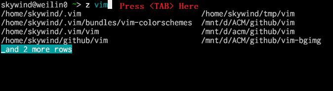
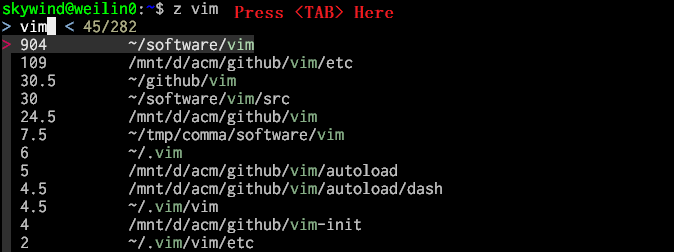
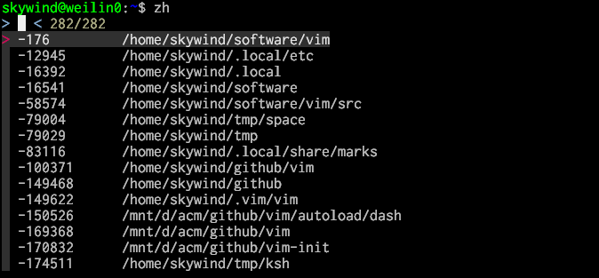

# z.lua

A command line tool which helps you navigate faster by learning your habits :zap:

An alternative to [z.sh](https://github.com/rupa/z) with windows and posix shells support and various improvements.

【[README in Chinese | 中文文档](README.cn.md)】


## Description

z.lua is a faster way to navigate your filesystem. It tracks your most used directories, based on 'frecency'.  After  a  short  learning  phase, z will take you to the most 'frecent' directory that matches ALL of the regexes given on the command line, in order.

For example, `z foo bar` would match `/foo/bar` but not `/bar/foo`.

## Reputation

From people using z.lua:

- I like this in principal. I’m pretty damn predictable at the command line and far too lazy to make shortcuts
- It feels far more intuitive and it's so incredibly convenient to be able to jump between folders I'm working in without having to traverse an entire tree. The shell used to feel so constraining for me, but tools like this are making me enjoy it so much more. 
- I can finally have autojump-like functionality on my Raspberry Pi 1 without waiting 30 seconds every time I open a new shell. Thanks z.lua devs.
- Anyway, z.lua is a promising project. If you only need directory jumping, it may be the best choice.


## Features

- **10x** times faster than **fasd** and **autojump**, **3x** times faster than **z.sh**.
- Gain the ultimate speed with an optional [native module](https://github.com/skywind3000/czmod) written in C.
- Available for **posix shells**: bash, zsh, dash, sh, ash, ksh, busybox and etc.
- Available for Fish Shell, Power Shell and Windows cmd.
- [Enhanced matching algorithm](#enhanced-matching) takes you to where ever you want precisely.
- Allow updating database only if `$PWD` changed with "$_ZL_ADD_ONCE" set to 1.
- Interactive selection enables you to choose where to go before cd.
- Integrated with FZF (optional) for interactive selection and completion.
- Quickly go back to a parent directory instead of typing "cd ../../..".
- Corresponding experience in different shells and operating systems. 
- Compatible with Lua (5.1, 5.2, 5.3+) and luajit.
- Self contained, distributed as a single `z.lua` script, no other dependence.


## Examples

```bash
z foo       # cd to most frecent dir matching foo
z foo bar   # cd to most frecent dir matching foo and bar
z -r foo    # cd to the highest ranked dir matching foo
z -t foo    # cd to most recently accessed dir matching foo
z -l foo    # list matches instead of cd
z -c foo    # restrict matches to subdirs of $PWD
z -e foo    # echo the best match, don't cd
z -i foo    # cd with interactive selection
z -I foo    # cd with interactive selection using fzf
z -b foo    # cd to the parent directory starting with foo
```


## Install

- Bash:

  put something like this in your `.bashrc`:

      eval "$(lua /path/to/z.lua --init bash)"

  the default matching algorithm is similar to z.sh to keep compatible, you may like the enhanced matching algorithm for productivity:

      eval "$(lua /path/to/z.lua --init bash enhanced once)"

  and perhaps this:

      eval "$(lua /path/to/z.lua --init bash enhanced once echo)"

  if you want `z.lua` print the new directory after cd. 

  For `fzf` tab completion use:

      eval "$(lua /path/to/z.lua --init bash enhanced once fzf)"
  
  **NOTE**: For wsl-1 users, `lua-filesystem` must be installed:

      sudo apt-get install lua-filesystem

  To avoid a wsl-1 [defect](https://github.com/microsoft/WSL/issues/5505).

- Zsh:

  put something like this in your `.zshrc`:

      eval "$(lua /path/to/z.lua --init zsh)"

  Options like "enhanced" and "once" can be used after `--init` too. It can also be initialized from "skywind3000/z.lua" with your zsh plugin managers (antigen / oh-my-zsh).

  **NOTE**: for wsl-1 users, `lua-filesystem` must be installed.

- Posix Shells:

  put something like this in your `.profile`:

      eval "$(lua /path/to/z.lua --init posix)"

  For old shells like ksh (Korn Shell), some features are missing, you can try:

      eval "$(lua /path/to/z.lua --init posix legacy)"

  To generate old posix compatible script.

- Fish Shell (version `2.4.0` or above):

  Create `~/.config/fish/conf.d/z.fish` with following code

      lua /path/to/z.lua --init fish | source

  If you'd like `z.lua` to cooperate with fish's own [directory history](https://fishshell.com/docs/3.2/index.html#id34), you can put

      set -gx _ZL_CD cd

  into the same file.

- Power Shell:

  > ⚠️ **WARNING**: users of [Starship Prompt](https://starship.rs/) should add the following command *after* `starship init`.
  
  put something like this in your `profile.ps1`:

      Invoke-Expression (& { (lua /path/to/z.lua --init powershell) -join "`n" })

- Windows cmd (with clink):

  - Copy z.lua and z.cmd to clink's home directory
  - Add clink's home to `%PATH%` (z.cmd can be called anywhere)
  - Ensure that "lua" can be called in `%PATH%`

- Windows cmder:

  - Copy z.lua and z.cmd to cmder/vendor
  - Add cmder/vendor to `%PATH%`
  - Ensure that "lua" can be called in `%PATH%`

- Windows WSL-1:

  Install `lua-filesystem` module before init z.lua:
        
        sudo apt-get install lua-filesystem

  This module is required due to a wsl-1 [defect](https://github.com/microsoft/WSL/issues/5505).


## Options

- set `$_ZL_CMD` in .bashrc/.zshrc to change the command (default z).
- set `$_ZL_DATA` in .bashrc/.zshrc to change the datafile (default ~/.zlua).
- set `$_ZL_NO_PROMPT_COMMAND` if you're handling PROMPT_COMMAND yourself.
- set `$_ZL_EXCLUDE_DIRS` to a comma separated list of dirs to exclude.
- set `$_ZL_ADD_ONCE` to '1' to update database only if `$PWD` changed.
- set `$_ZL_MAXAGE` to define a aging threshold (default is 5000).
- set `$_ZL_CD` to specify your own cd command (default is `builtin cd` in Unix shells).
- set `$_ZL_ECHO` to 1 to display new directory name after cd.
- set `$_ZL_MATCH_MODE` to 1 to enable enhanced matching.
- set `$_ZL_NO_CHECK` to 1 to disable path validation, use `z --purge` to clean
- set `$_ZL_HYPHEN` to 1 to treat hyphon (-) as a normal character not a lua regexp keyword.
- set `$_ZL_CLINK_PROMPT_PRIORITY` change clink prompt register priority (default 99).

## Aging

The rank of directories maintained by z.lua undergoes aging based on a simple formula. The rank of each entry is incremented  every  time  it  is accessed.  When the sum of ranks is over 5000 (`$_ZL_MAXAGE`), all ranks are multiplied by 0.9. Entries with a rank lower than 1 are forgotten.


## Frecency

Frecency is a portmanteau of 'recent' and 'frequency'. It is a weighted rank that depends on how often and how recently something occurred. As far as I know, Mozilla came up with the term.

To z.lua, a directory that has low ranking but has been accessed recently will quickly  have higher rank than a directory accessed frequently a long time ago. Frecency is determined at runtime.


## Default Matching

By default, z.lua uses default matching algorithm similar to the original z.sh. Paths must be match all of the regexes in order.

- cd to a directory contains foo:

      z foo

- cd to a directory ends with foo:

      z foo$

- use multiple arguments:

  Assuming the following database:

      10   /home/user/work/inbox
      30   /home/user/mail/inbox

  `"z in"` would cd into `/home/user/mail/inbox` as the higher weighted entry. However you can pass multiple arguments to z.lua to prefer a different entry. In the above example, `"z w in"` would then change directory to `/home/user/work/inbox`.

## Enhanced Matching

Enhanced matching can be enabled by exporting the environment:

```bash
export _ZL_MATCH_MODE=1
```

Or, append a `enhanced` after `--init xxx`:

```bash
eval "$(lua /path/to/z.lua --init bash enhanced)"
```

For a given set of queries (the set of command-line arguments passed to z.lua), a path is a match if and only if:

1. Queries match the path in order (same as default method).
2. The last query matches the last segment of the path.

If no match is found, it will fall back to default matching method.

- match the last segment of the path:

  Assuming the following database:

      10   /home/user/workspace
      20   /home/user/workspace/project1
      30   /home/user/workspace/project2
      40   /home/user/workspace/project3

  If you use `"z wo"` in enhanced matching mode, only the `/home/user/workspace` will be matched, because according to rule No.2 it is the only path whose last segment matches `"wo"`.

  Since the last segment of a path is always easier to be recalled, it is sane to give it higher priority. You can also achieve this by typing `"z space$"` in both methods, but `"z wo"` is easier to type.

  Tips for rule No.2: 

  - If you want your last query **not only** to match the last segment of the path, append '$' as the last query. eg. `"z wo $"`. 
  - If you want your last query **not** to match the last segment of the path, append '/' as the last query. eg. `"z wo /"`.
 

- cd to the existent path if there is no match:

  Sometimes if you use:

      z foo

  And there is no matching result in the database, but there is an existent directory which can be accessed with the name "foo" from current directory, "`z foo`" will just work as:

      cd foo

  So, in the enhanced matching method, you can always use `z` like `cd` to change directory even if the new directory is untracked (hasn't been accessed).

- Skip the current directory:

  When you are calling `z xxx` but the best match is the current directory, z.lua will choose the 2nd best match result for you. Assuming the database:

      10   /Users/Great_Wall/.rbenv/versions/2.4.1/lib/ruby/gems
      20   /Library/Ruby/Gems/2.0.0/gems

  When I use `z gems` by default, it will take me to `/Library/Ruby/Gems/2.0.0/gems`, but it's not what I want, so I press up arrow and execute `z gems` again, it will take me to `/Users/Great_Wall/.rbenv/versions/2.4.1/lib/ruby/gems` and this what I want.

  Of course, I can always use `z env gems` to indicate what I want precisely. Skip the current directory means when you use `z xxx` you always want to change directory instead of stay in the same directory and do nothing if current directory is the best match.

The default matching method is designed to be compatible with original z.sh, but the enhanced matching method is much more handy and exclusive to z.lua.


## Add Once

By default, z.lua will add current directory to database each time before display command prompt (correspond with z.sh). But there is an option to allow z.lua add path only if current working directory changed.

To enable this, you can set `$_ZL_ADD_ONCE` to `1` before init z.lua. Or you can initialize z.lua on linux like this:

````bash
eval "$(lua /path/to/z.lua --init bash once)"
eval "$(lua /path/to/z.lua --init zsh once)"
lua /path/to/z.lua --init fish once | source
````

With `add once` mode off (default), z.lua will consider the time you spent in the directory (like z.sh). When this mode is on, consider the times you accessed the directory (like autojump), and that could be much faster on slow hardware. 


## Interactive Selection

When there are multiple matches found, using `z -i` will display a list:

```bash
$ z -i soft
3:  0.25        /home/data/software
2:  3.75        /home/skywind/tmp/comma/software
1:  21          /home/skywind/software
> {CURSOR}
```

And then you can input the number and choose where to go before actual cd. eg. input 3 to cd to `/home/data/software`. And if you just press ENTER and input nothing, it will just quit and stay where you were.

NOTE: for fish shell, this feature requires fish 2.7.0 or above.


## FZF Supports

From version 1.1.0, a new option `"-I"` will allow you to use fzf to select when there are multiple matches. 


When we use `"z -I vim"`，12 paths contains keyword "vim" has been matched and ordered by their frecent value, the higher frecent comes with the higher rank. Then without cd to the highest ranked path, z.lua passes all the candidates to fzf. 

Now you can input some space separated keywords (no order required) or use `CTRL+J`/`CTRL+K` (same as `UP`/`DOWN`) to select where you want to go, or `ESC` / `CTRL`+`D`/`G` to give up. 

Of course, you can always give more keywords to `z` command to match your destination precisely. `"z -I"` is similar to `"z -i"`, but use fzf. Both `"-i"` and `"-I"` provide you another way for path navigation.

Usually, `z -I` can be aliased to `zf` (z + fuzzy finder) for convenience. If there are only one path matched, `z -I` will jump to it directly, fzf will only be invoked for multiple matches. `"z -I ."` or `"zf ."` can be used to use fzf select from entire database. 

For more information about this, please visit [wiki - effective with fzf](https://github.com/skywind3000/z.lua/wiki/Effective-with-fzf).

NOTE: For fish shell, this feature requires fish 2.7.0 or above. You can specify fzf executable in `$_ZL_FZF` environment variable, `"fzf"` will be called by default.


## Jump Backwards

New option `"-b"` can quickly go back to a specific parent directory in bash instead of typing "cd ../../.." redundantly.

- **(No argument)**: `cd` into the project root, the project root the nearest parent directory with `.git`/`.hg`/`.svn` in it.
- **(One argument)**: `cd` into the closest parent starting with keyword, if not find, go to the parent containing keyword.
- **(Two arguments)**: replace the first value with the second one (in the current path).

Let's start by aliasing `z -b` to `zb`:

```bash
# go all the way up to the project root (in this case, the one that has .git in it)
~/github/lorem/src/public$ zb
  => cd ~/github/lorem

# cd into to the first parent directory named g*
~/github/vimium/src/public$ zb g
  => cd ~/github

# goto the site directory quickly
~/github/demo/src/org/main/site/utils/file/reader/whatever$ zb si
  => cd ~/github/demo/src/org/main/site

# substitute jekyll with ghost
~/github/jekyll/test$ zb jekyll ghost
  => cd ~/github/ghost/test
```

Backward jumping can also be used with `$_ZL_ECHO` option (echo $PWD after cd), which makes it possible to combine them with other tools without actually changing the working directory (eg. ``ls `zb git` ``). 

Environment variable `$_ZL_ROOT_MARKERS` is a comma separated list for project root locating, and can be redefined as:

```bash
export _ZL_ROOT_MARKERS=".git,.svn,.hg,.root,package.json"
```

If you want `zb` jump back to a parent directory contains a `.root` or `package.json` in it.

**Bonus**: `zb ..` equals to `cd ..`, `zb ...` equals to `cd ../..` and `zb ....` equals to `cd ../../..`, and so on. Finally, `zb ..20` equals to `cd (..)x20`.

**Bonus**: try `z -b -i` and `z -b -I` and you can alias them to `zbi` and `zbf`.

## Completion

For zsh/fish, completion can be triggered by `z foo<tab>`. and a list of candidates will display in zsh / fish:



Press `<tab>` again, you can select your destination in a visualized way.

Bash is not as powerful as zsh/fish, so we introduced fzf-completion for bash, initialize your z.lua and append `fzf` keyword after `--init`:

```bash
eval "$(lua /path/to/z.lua --init bash enhanced once echo fzf)"
```

Then press `<tab>` after `z xxx`:



With the help of fzf, completion in bash is much easier now. 

`z.lua` can cooperate with [fz](https://github.com/changyuheng/fz) for **better completion** result in both bash and zsh, for more information see [FAQ](https://github.com/skywind3000/z.lua/wiki/FAQ#fzsh-for-better-completion).

NOTE: To enable this, command `fzf` must be found in `$PATH` before initialization.


## Most Recently Accessed Path

`z.lua` provides a fast way to visit MRU directories without typing any keyword. That is `dirstack`, which records recently visited paths and can be manipulated by `z -`, `z --` and `z -{num}`:

```bash
# display current dir stack
$ z --    
 0  /home/skywind/work/match/memory-match
 1  /home/skywind/.local/etc
 2  /home/skywind/software/vifm-0.9.1
 3  /home/skywind/work
 4  /home/skywind/work/match

# cd to the 2nd directory in the stack
$ z -2
  => cd /home/skywind/software/vifm-0.9.1

# popup stacktop (cd to previous directory), same as "z -0"
$ z -
  => cd -
```

The `dirstack` is calculated from z.lua's database, and has no dependency on shells or systems. You will not lost records after re-login, and history can be shared across shells and sessions.

There is another way to access MRU directories interactively by utilizing parameter `-I` (fzf) and `-t` (sort by time):

```bash
alias zh='z -I -t .'
```

The new alias `zh` (jump to history) is very easy to input:



The first column indicates how many seconds ago you have visited, and the second column is the path name. With `zh`, you can type some character to use string matching in fzf, or use `<Up>`/`<Down>` (as well as `CTRL+j/k`) to move the selector (red `>`) up and down. 

At last, press `<enter>` to accept or `<ESC>` to give up. 

Remember to enable the [enhanced matching](#enhanced-matching) algorithm, the current working directory can be skipped with it.


## Tips

Recommended aliases you may find useful:

```bash
alias zz='z -c'      # restrict matches to subdirs of $PWD
alias zi='z -i'      # cd with interactive selection
alias zf='z -I'      # use fzf to select in multiple matches
alias zb='z -b'      # quickly cd to the parent directory
```

Import data from z.sh：


```bash
cat ~/.z >> ~/.zlua
```

Import data from autojump：

```bash
FN="$HOME/.local/share/autojump/autojump.txt"
awk -F '\t' '{print $2 "|" $1 "|" 0}' $FN >> ~/.zlua
```

Don't forget to read the [Frequently Asked Questions](https://github.com/skywind3000/z.lua/wiki/FAQ).


## Benchmark

The slowest part is adding path to history data file. It will run every time when you press enter (installed in $PROMPT_COMMAND). So I profile it on my NAS:

```bash
$ time autojump --add /tmp
real    0m0.352s
user    0m0.077s
sys     0m0.185s

$ time fasd -A /tmp
real    0m0.618s
user    0m0.076s
sys     0m0.242s

$ time _z --add /tmp
real    0m0.194s
user    0m0.046s
sys     0m0.154s

$ time _zlua --add /tmp
real    0m0.052s
user    0m0.015s
sys     0m0.030s
```

As you see, z.lua is the fastest one and requires less resource.

## Native Module

z.lua is fast enough for most case, the path tracking action will be triggered each time when you change your current directory.

So I still recommend the pure lua script for portability and flexibility, but for someone who really care about `10ms` or `1ms` things, this module can help them to gain the ultimate speed.

- [czmod](https://github.com/skywind3000/czmod): native module to boost `z.lua`.

Average performance:

| Name | czmod |  z.lua |
|-|-|-|
| **Update Time** | 1.6ms | 13.2ms |
| **Query Time** | 1.5ms | 9.8ms |


## History

- 1.8.7 (2020-06-29): use lfs or luajit's cffi if possible.
- 1.8.4 (2020-02-10): fish shell: set `$_ZL_ECHO` to global scope.
- 1.8.3 (2020-02-09): new: `z -b -i` and `z -b -I` to jump backwards in interactive mode.
- 1.7.4 (2019-12-29): new: `$_ZL_HYPHEN` to treat hyphen as a normal character, see [here](https://github.com/skywind3000/z.lua/wiki/FAQ#how-to-input-a-hyphen---in-the-keyword-).
- 1.7.3 (2019-09-07): use [lua-filesystem](http://keplerproject.github.io/luafilesystem/) package if possible when `$_ZL_USE_LFS` is `1`.
- 1.7.2 (2019-08-01): Improve bash/zsh shell compatibility by [@barlik](https://github.com/barlik).
- 1.7.1 (2019-06-07): Fixed: `$_ZL_DATA` failure on Linux sometimes.
- 1.7.0 (2019-03-09): Support [ranger](https://github.com/skywind3000/z.lua/wiki/FAQ#how-to-integrate-zlua-to-ranger-), fix ReplaceFile issue in luajit (windows).
- 1.6.0 (2019-03-04): optimize with ffi module (luajit builtin module).
- 1.5.11 (2019-03-02): fixed: os.path.isdir doesn't work for symbol link folders.
- 1.5.10 (2019-03-01): Prevent writing file racing.
- 1.5.9 (2019-02-25): `z -b` should not match current directory (close #56).
- 1.5.8 (2019-02-21): new `$_ZL_FZF_HEIGHT` to control `--height` parameter in fzf.
- 1.5.7 (2019-02-21): rename `$_ZL_FZF_SORT` to `$_ZL_INT_SORT` it will affect both `-i` and `-I`.
- 1.5.6 (2019-02-20): set `$_ZL_FZF_SORT` to 1 to sort directories by alphabet in fzf.
- 1.5.5 (2019-02-20): `$_ZL_FZF_FLAG` can be used to override fzf flags, default to "+s -e".
- 1.5.4 (2019-02-19): fixed: file/path existence detection fails on read-only fs (closed [#49](https://github.com/skywind3000/z.lua/issues/49) by [@contrun](https://github.com/contrun)).
- 1.5.3 (2019-02-17): new `$_ZL_FZF_FLAG` for passing additional flags to fzf, add `-e` argument to fzf.
- 1.5.2 (2019-02-16): be aware of all arguments in fzf completion.
- 1.5.1 (2019-02-15): new: simulated dir stack by `z -`, `z --` and `z -{num}`.
- 1.5.0 (2019-02-14): fixed minor issues in backward jumping.
- 1.4.7 (2019-02-13): Don't use regex in backward jumping (use plain text instead).
- 1.4.6 (2019-02-12): change: `_ZL_EXCLUDE_DIRS` to a comma separated list of dirs to exclude.
- 1.4.5 (2019-02-10): improve bash fzf completion and posix compatibility.
- 1.4.4 (2019-02-10): supports legacy posix shells like ksh, init with `z.lua --init posix legacy`.
- 1.4.3 (2019-02-08): fixed minor issues.
- 1.4.2 (2019-02-06): you can disabled path validation by `$_ZL_NO_CHECK`, and use `z --purge` to clear bad paths manually.
- 1.4.1 (2019-02-06): fzf tab-completion in bash ([@BarbUk](https://github.com/BarbUk)), fixed hang in fish shell (close [#29](https://github.com/skywind3000/z.lua/issues/29)).
- 1.4.0 (2019-02-04): Ported to Power Shell ([@manhong2112](https://github.com/manhong2112))
- 1.3.0 (2019-02-04): Backward jumping, prevent "cd ../../.." repeatly.
- 1.2.0 (2019-02-03): Upgrade string lib and path lib.
- 1.1.0 (2019-02-02): New option '-I' to use fzf to select from multiple matches.
- 1.0.0 (2019-02-01): Fixed minor issues and make it stable.
- 0.5.0 (2019-01-21): Ported to Fish Shell ([@TeddyDD](https://github.com/TeddyDD)).
- 0.4.1 (2019-01-20): Don't return failed exit code when $_ZL_ECHO is unbind (Mario Rodas).
- 0.4.0 (2019-01-17): new enhanced matching algorithm，can be enabled by appending `enhanced` keyword after `--init`.
- 0.3.0 (2018-12-26): new option `-i` to enable interactive selection.
- 0.2.0 (2018-11-25): new option `$_ZL_ADD_ONCE` to enable updating datafile only if `$PWD` changed.
- 0.1.0 (2018-04-30): supports windows cmd, cmder and conemu.
- 0.0.0 (2018-03-21): initial commit, compatible with original z.sh.

## Help

This project needs help for the tasks below:

- [ ] Support csh/tcsh.
- [ ] Completion: Actually I got little knowledge in completion, and need help to improve it.
- [ ] Completion: Implement completion for Power Shell.
- [ ] Completion: Implement completion for different arguments.
- [ ] Packaging: make it possible to be installed easily in different systems or popular plugin managers.


## Thanks

- Thanks to [@rupa](https://github.com/rupa) for inspiring me to start this project.
- Thanks to [@vigneshwaranr](https://github.com/vigneshwaranr) and [@shyiko](https://github.com/shyiko) for inspiring me the backward jumping.
- Thanks to [@TeddyDD](https://github.com/TeddyDD) for Fish Shell porting.
- Thanks to [@manhong2112](https://github.com/manhong2112) for Power Shell porting.
- Thanks to [@BarbUk](https://github.com/BarbUk) for fzf completion in Bash.
- Thanks to [@barlik](https://github.com/barlik) for many improvements.

And many others.


## License

Licensed under MIT license.

